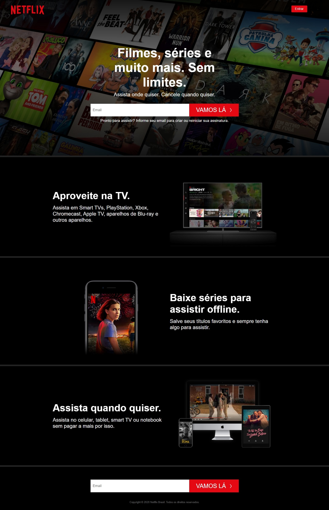

  
  
  
  
  

 

  

### Exercício HTML CSS - Netflix
#### Faça um clone da home page do site Netflix usando apenas html e css.
##
<h1 align="center">
  Resultado Final
</h1>

  

#### Concluído em 2020 ✔
